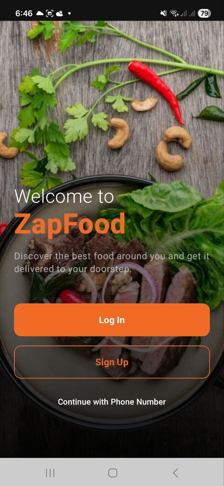
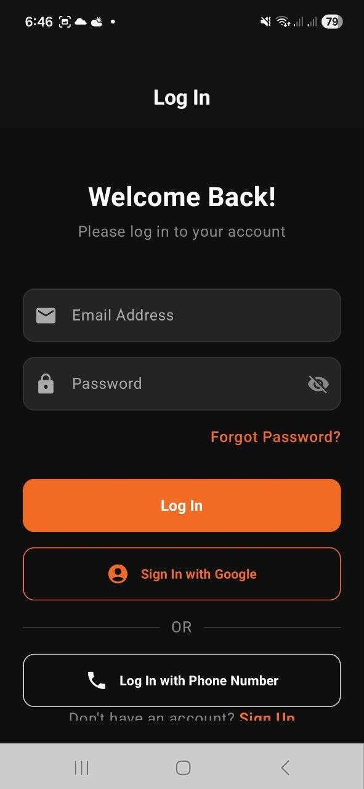
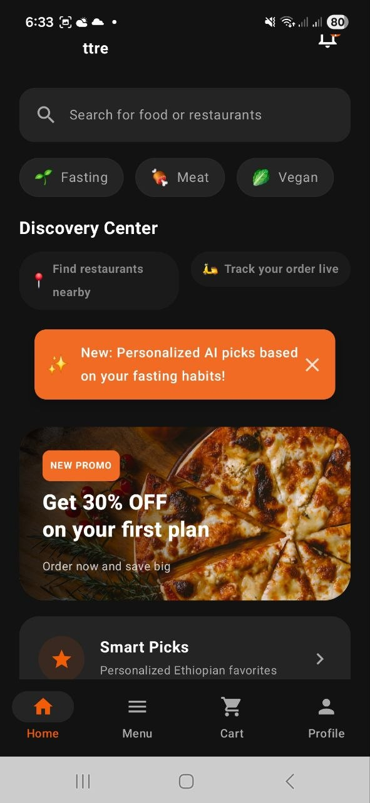
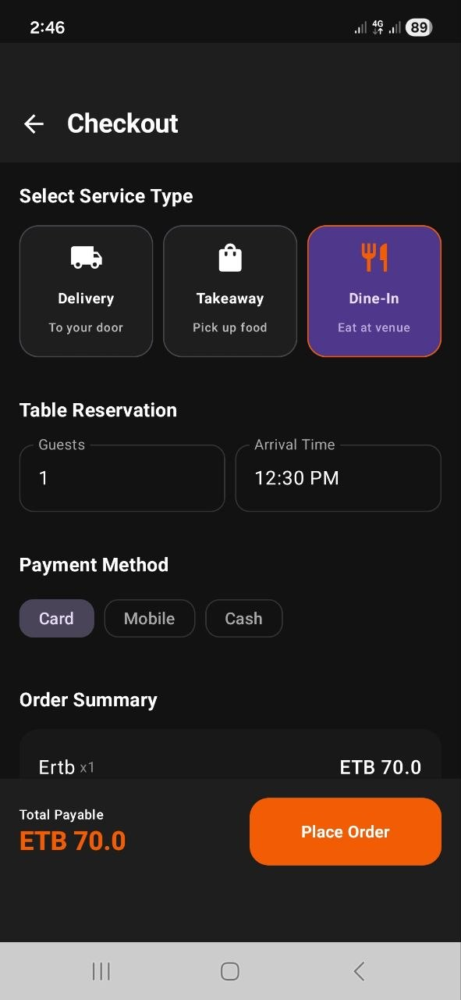
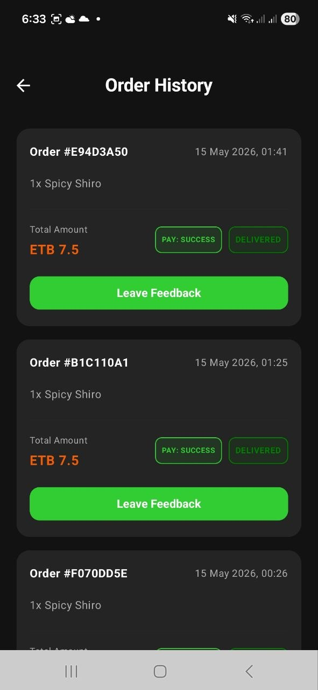
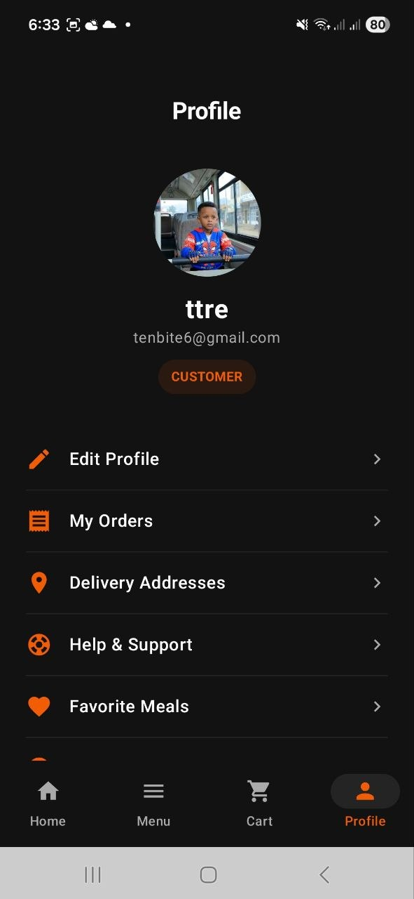
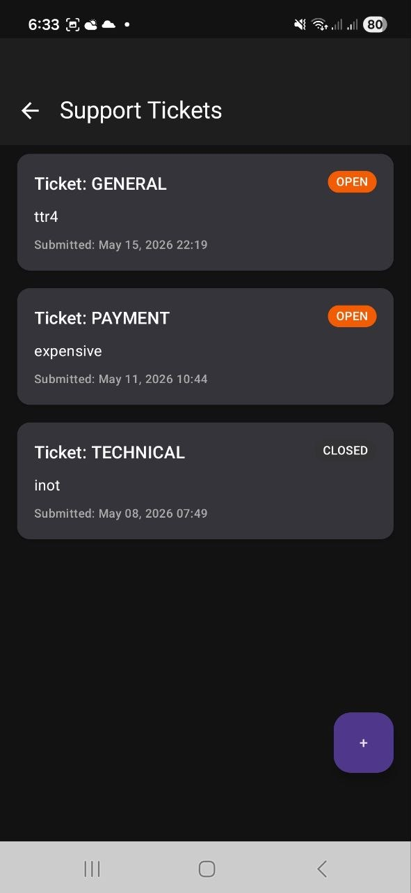

# Food Delivery Intelligence Platform

A comprehensive, AI-ready food delivery platform built with Kotlin and Jetpack Compose for Android, bac ked by Firebase and a Python FastAPI backend. The platform supports three distinct user roles: Customers, Vendors, and Administrators, with specialized features for Ethiopian food intelligence.

## 📸 Visual Preview

<table align="center">
  <tr>
    <td align="center" valign="top" width="33%">
      
      <br/><sub><b>Welcome Screen</b></sub>
    </td>
    <td align="center" valign="top" width="33%">
      
      <br/><sub><b>Customer Authentication</b></sub>
    </td>
    <td align="center" valign="top" width="33%">
      
      <br/><sub><b>AI Discovery Hub</b></sub>
    </td>
  </tr>
  <tr>
    <td align="center" valign="top" width="33%">
      
      <br/><sub><b>Dine-In Reservation & Checkout</b></sub>
    </td>
    <td align="center" valign="top" width="33%">
      
      <br/><sub><b>Order History</b></sub>
    </td>
    <td align="center" valign="top" width="33%">
      
      <br/><sub><b>Customer Profile & Account</b></sub>
    </td>
  </tr>
  <tr>
    <td align="center" valign="top" width="33%">
      
      <br/><sub><b>Support Tickets Hub</b></sub>
    </td>
    <td align="center" valign="top" width="33%">
    </td>
    <td align="center" valign="top" width="33%">
    </td>
  </tr>
</table>

## Achieved Core Capabilities

### 🍽️ Customer Discovery & "Arrive & Eat" Dine-In Hub
- **Cultural Recommendation Engine:** Adaptive discovery recommendations (Fasting, Meat, Vegan) with fasting-day meal alerts driven by real-time fasting state observation (`EthiopianBehaviorIntelligence`).
- **"Arrive & Eat" Smart Table QR System:** Session-managed, waiter-less dining. Customers scan table-specific QR codes to check-in, browse menu packages, route dine-in orders directly to tables, and perform one-tap settlement.
- **Fast checkout with Chapa Payment:** Secure digital checkout redirects supporting mobile money channels, deep-linked callbacks (`zapfood://payment/return`), and transaction verification.

<p align="center">
  
  
  
</p>

### 🏪 Merchant Command OS (Vendor Portal)
- **Role-Based Single-App Navigation:** Dynamic startup intercepts that seamlessly guide logged-in users directly to their merchant command center or customer discovery center depending on their verified role.
- **Exhaustive Order Handling State Machine:** Interactive order status timeline (Accept -> Prepare -> Mark Ready -> Deliver) syncing to Firestore document streams.
- **Detailed Menu & Tagging Management:** Interface for vendors to catalog products with detailed culinary metadata (cuisine type, fasting friendly, spice, and protein levels).

### 🛡️ Admin Control Center
- **System Health Monitor:** Real-time analytics dashboard presenting gross sales aggregates, system responsiveness, total active customer nodes, and system logs.
- **Vendor Onboarding Verification Hub:** Structured review boards listing vendor onboarding requests.
- **Live Ticket Support Desk:** Central resolution center where platform administrators can live-chat and process dispute resolutions directly.

<p align="center">
  
</p>

## Tech Stack

### Android (Frontend)
- **Language**: Kotlin
- **UI Framework**: Jetpack Compose
- **Architecture**: Clean Architecture (Presentation, Domain, Data layers) + MVVM
- **Asynchronous**: Kotlin Coroutines & Flow
- **Dependency Injection**: Manual DI
- **Push Notifications**: Firebase Cloud Messaging (FCM)

### Backend & Cloud
- **Database**: Firebase Firestore (Realtime NoSQL)
- **Authentication**: Firebase Auth
- **Payment Gateway Backend**: Python FastAPI (Handles Chapa Webhooks & Security)
- **Notifications**: Firestore triggers / FCM

## Project Structure

```text
app/src/main/java/com/example/food/
├── core/           # Utilities, standard resource wrappers, UI themes
├── data/           # Models, Repositories (Firestore), Remote Services
├── domain/         # Use Cases (Business logic, state machines)
├── ui/             # Jetpack Compose Screens, ViewModels, Navigation
└── MainActivity.kt # Entry point
```

## Setup & Installation

### Android Setup
1. Clone the repository and open it in Android Studio.
2. Connect your project to Firebase:
   - Add your `google-services.json` file to the `app/` directory.
   - Ensure Authentication (Email/Password) and Firestore are enabled in your Firebase console.
3. Build and run the app on an emulator or physical device running Android API 24+.

### Backend Setup (Payment Webhooks)
1. Navigate to the `backend/` directory.
2. Install Python dependencies:
   ```bash
   pip install -r requirements.txt
   ```
3. Copy `.env.example` to `.env` and fill in your Chapa API keys and Firebase credentials.
4. Run the FastAPI server:
   ```bash
   uvicorn app.main:app --host 0.0.0.0 --port 8000 --reload
   ```

## Key Architectures

### AI-Ready Food Intelligence
The meal entity is structured to support future AI recommendation engines. It includes highly specific metadata such as `CuisineType`, `SpiceLevel`, `ProteinLevel`, and arrays of tags, allowing for complex vector searches and personalized user diets (e.g., Ethiopian Fasting menus).

### Realtime State Synchronization
The app relies heavily on `Flow` and `callbackFlow` to listen to Firestore snapshot changes. This ensures that when a vendor accepts an order, the customer's UI updates instantly without requiring a manual refresh.

### Exhaustive State Machines
Order lifecycles and notification types are strictly governed by exhaustive `when` expressions, ensuring that edge-case states cannot cause UI crashes or silent failures.
