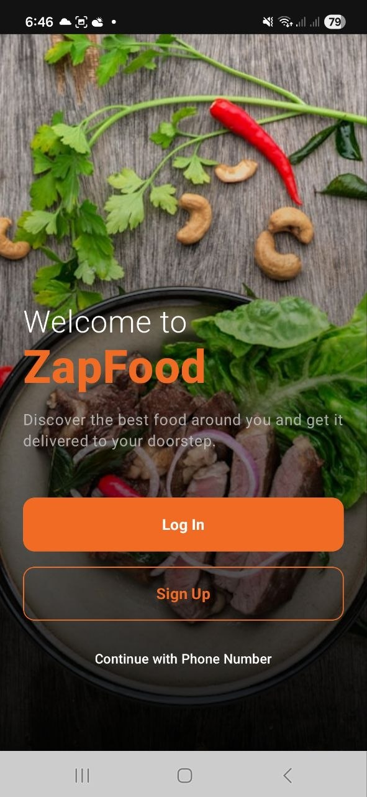
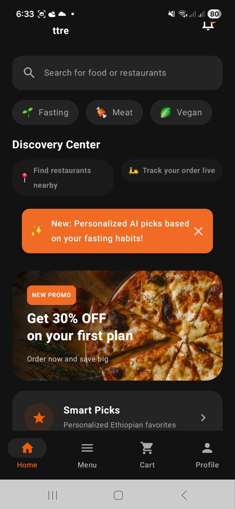
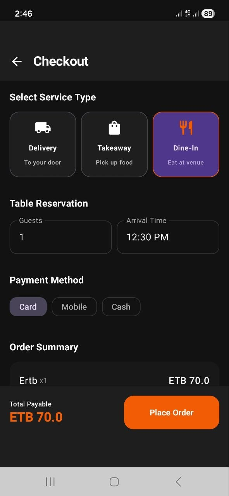
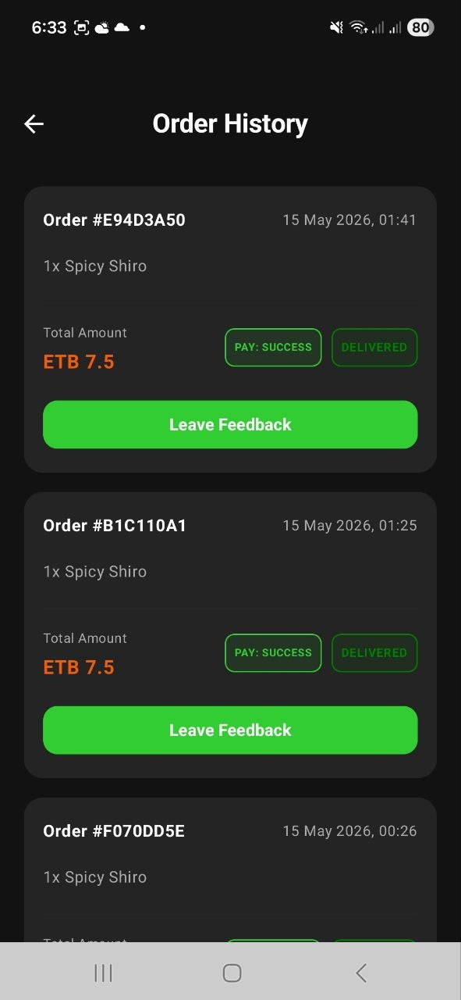
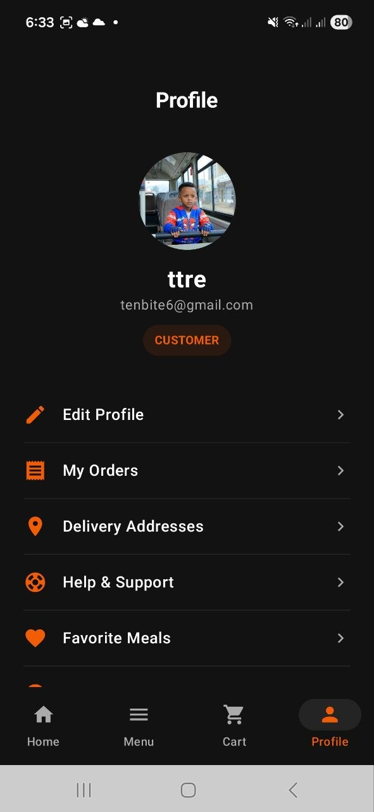
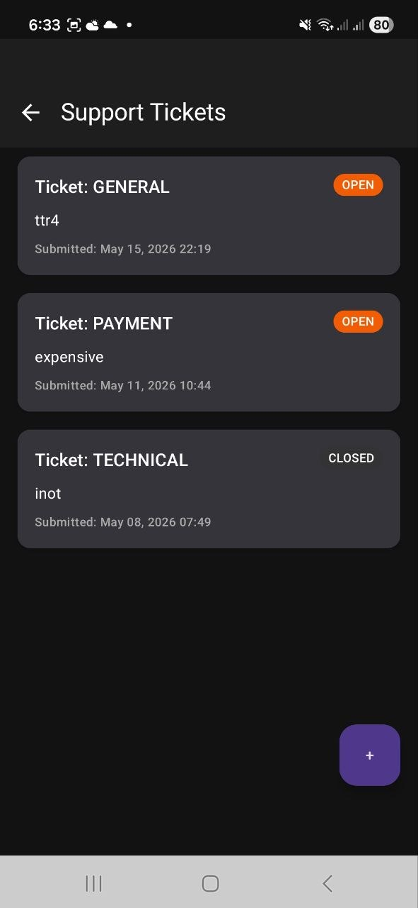

# 🍽️ ZapFood — AI-Powered Food Delivery & Restaurant Intelligence Platform

> A next-generation Ethiopian food delivery ecosystem combining intelligent meal discovery, smart dine-in experiences, real-time order management, and AI-ready culinary intelligence.

Built with **Kotlin**, **Jetpack Compose**, **Firebase**, and **FastAPI**, ZapFood serves three interconnected platforms:

* 👤 **Customers**
* 🏪 **Vendors**
* 🛡️ **Administrators**

Designed from the ground up for scalability, personalization, and the unique dynamics of Ethiopian dining culture.

---

# ✨ Overview

ZapFood goes beyond traditional food delivery applications.

The platform introduces an intelligent restaurant ecosystem where customers can discover culturally relevant meals, vendors can manage operations in real time, and administrators can monitor platform health through centralized controls.

### Core Innovations

✅ AI-Ready Food Recommendation Engine

✅ QR-Based "Arrive & Eat" Smart Dining

✅ Real-Time Order Synchronization

✅ Ethiopian Fasting-Aware Meal Discovery

✅ Vendor Command Center

✅ Admin Operations Dashboard

✅ Secure Digital Payments with Chapa

✅ Support Ticket Resolution System

---

# 📱 Application Preview

### Customer Experience

| Welcome                                   | Authentication                            | Discovery Hub                             |
| ----------------------------------------- | ----------------------------------------- | ----------------------------------------- |
|  |  |  |

| Smart Dine-In                             | Order History                             | Profile                                   |
| ----------------------------------------- | ----------------------------------------- | ----------------------------------------- |
|  |  |  |

### Platform Support Center

| Ticket Resolution Hub                     |
| ----------------------------------------- |
|  |

---

# 🚀 Key Features

## 👤 Customer Platform

### Intelligent Food Discovery

An adaptive recommendation engine designed specifically for Ethiopian dining habits.

Features include:

* Fasting-aware meal recommendations
* Meat, vegan, and vegetarian categorization
* Personalized food suggestions
* Cuisine-based filtering
* Behavioral preference learning

The recommendation infrastructure is powered by:

```kotlin
EthiopianBehaviorIntelligence
```

allowing future AI personalization and predictive recommendations.

---

### 🍽️ Smart "Arrive & Eat" Experience

Traditional dine-in experiences often require waiting for menus, waiters, and billing.

ZapFood introduces a QR-powered dining workflow:

1. Scan table QR code
2. Automatically check in
3. Browse menu packages
4. Order directly to your table
5. Pay digitally
6. Leave without waiting

Benefits:

* Reduced waiter dependency
* Faster table turnover
* Better customer experience
* Seamless digital payments

---

### 💳 Secure Payment Processing

Integrated with Chapa for secure Ethiopian payment processing.

Features:

* Mobile money support
* Digital checkout
* Transaction verification
* Deep-link payment callbacks

```text
zapfood://payment/return
```

---

## 🏪 Vendor Command Center

A complete operational dashboard for restaurants.

### Order Management System

Real-time order lifecycle management:

```text
Pending
   ↓
Accepted
   ↓
Preparing
   ↓
Ready
   ↓
Delivered
```

Every transition is synchronized instantly across customer and vendor devices.

---

### Menu Intelligence Management

Vendors can enrich food listings with structured metadata:

* Cuisine Type
* Protein Level
* Spice Level
* Dietary Tags
* Fasting Compatibility
* Custom Labels

This structure enables advanced search, filtering, and future AI recommendations.

---

### Role-Aware Navigation

Users are automatically routed to the appropriate experience:

* Customer Portal
* Vendor Dashboard
* Admin Console

without requiring separate applications.

---

## 🛡️ Administrative Control Center

### Platform Analytics Dashboard

Administrators gain visibility into:

* Total sales
* Active users
* Vendor activity
* Order volume
* Platform health
* System performance

---

### Vendor Verification Workflow

Structured onboarding review system:

* Vendor applications
* Verification status
* Approval workflows
* Restaurant compliance checks

---

### Support & Dispute Resolution

Centralized support infrastructure:

* Customer tickets
* Vendor disputes
* Live messaging
* Resolution tracking

---

# 🏗️ Architecture

The project follows **Clean Architecture** principles with strict separation of concerns.

```text
Presentation Layer
        │
        ▼
Domain Layer
        │
        ▼
Data Layer
```

### Architectural Patterns

* Clean Architecture
* MVVM
* Repository Pattern
* Use Case Pattern
* State Machines
* Reactive Streams

---

# ⚙️ Technology Stack

## Android

| Technology                  | Purpose                 |
| --------------------------- | ----------------------- |
| Kotlin                      | Core Language           |
| Jetpack Compose             | Modern UI               |
| Coroutines                  | Asynchronous Operations |
| Flow                        | Reactive Streams        |
| Firebase Cloud Messaging    | Push Notifications      |
| Navigation Compose          | Navigation              |
| Manual Dependency Injection | Service Management      |

---

## Backend & Infrastructure

| Technology               | Purpose                |
| ------------------------ | ---------------------- |
| Firebase Auth            | Authentication         |
| Firestore                | Realtime Database      |
| FastAPI                  | Payment & API Services |
| Chapa                    | Payment Gateway        |
| Firebase Cloud Messaging | Notifications          |

---

# 📂 Project Structure

```text
app/src/main/java/com/example/food

├── core/
│   ├── common
│   ├── resources
│   └── theme
│
├── data/
│   ├── repositories
│   ├── models
│   └── services
│
├── domain/
│   ├── usecases
│   ├── statemachines
│   └── businesslogic
│
├── ui/
│   ├── screens
│   ├── navigation
│   ├── viewmodels
│   └── components
│
└── MainActivity.kt
```

---

# 🔄 Real-Time Synchronization

The platform leverages Firestore snapshot listeners combined with Kotlin Flows:

```kotlin
callbackFlow { }
```

This enables:

* Instant order updates
* Live ticket conversations
* Real-time vendor notifications
* Synchronized customer experiences

without requiring manual refreshes.

---

# 🧠 AI-Ready Food Intelligence

Every meal is represented using structured culinary metadata.

```kotlin
CuisineType
ProteinLevel
SpiceLevel
Tags[]
```

This design enables future implementation of:

* Vector Search
* Semantic Recommendations
* Personalized Diet Planning
* Predictive Ordering
* AI Food Discovery

without major database redesigns.

---

# 🔒 State-Driven Reliability

Critical business processes use exhaustive state machines.

Examples include:

* Order Lifecycle
* Payment Status
* Ticket Resolution
* Notification Routing

This approach minimizes invalid states and significantly reduces production failures.

---

# 🚀 Getting Started

## Android Setup

```bash
git clone <repository-url>
```

1. Open in Android Studio
2. Add `google-services.json`
3. Enable Firebase Authentication
4. Enable Firestore
5. Run on Android API 24+

---

## Backend Setup

```bash
cd backend

pip install -r requirements.txt
```

Configure:

```env
CHAPA_SECRET_KEY=
FIREBASE_CREDENTIALS=
```

Run:

```bash
uvicorn app.main:app --reload
```

---

# 🎯 Future Roadmap

### Version 2

* AI meal recommendations
* Customer preference modeling
* Restaurant ranking intelligence

### Version 3

* Driver & logistics module
* Live delivery tracking
* Route optimization

### Version 4

* AI chatbot ordering assistant
* Voice-powered food search
* Advanced analytics platform

---     

### Built with ❤️ for the Ethiopian DBU Food Ecosystem


### Exhaustive State Machines
Order lifecycles and notification types are strictly governed by exhaustive `when` expressions, ensuring that edge-case states cannot cause UI crashes or silent failures.
